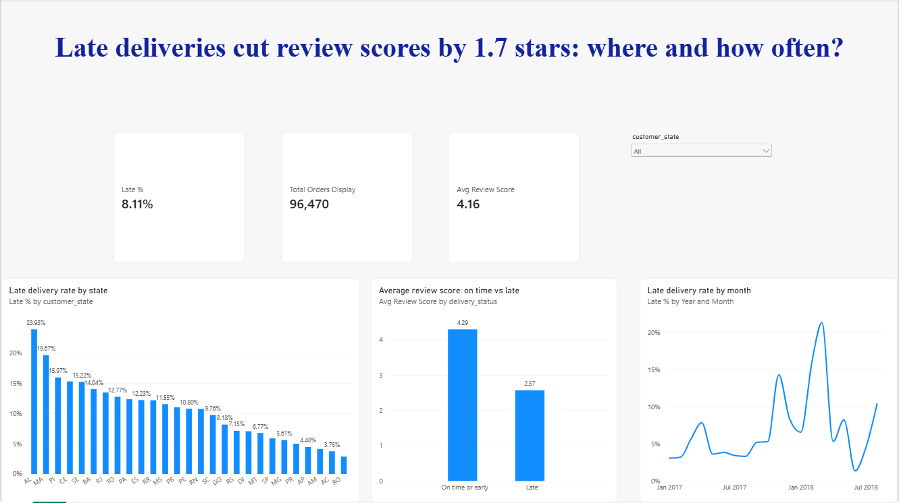

# Olist Delivery Performance Analysis (PostgreSQL + Power BI)

**Business question:** Do late deliveries hurt customer reviews, and where is the problem concentrated?

**Headline finding:** 8.1% of delivered orders arrived after the promised date. Those orders average **2.57 stars vs 4.29** for on-time orders, a gap of about 1.7 stars. Late rates reach 14-24% in several northeastern states.

## Dataset
[Brazilian E-Commerce Public Dataset by Olist](https://www.kaggle.com/datasets/olistbr/brazilian-ecommerce) (Kaggle): about 100k orders from 2016-2018 across 9 related tables. I used `orders`, `customers`, `order_items`, `order_reviews` and `sellers`.

## Tools
- **PostgreSQL / pgAdmin:** data loading, joins, CTE-free aggregations, `CASE` logic, a reporting view
- **Power BI:** DAX measures and an interactive dashboard

## Approach
1. Loaded the CSVs into PostgreSQL and checked row counts against the source files.
2. Profiled order statuses. 96,478 of 99,441 orders (97%) are `delivered`; the rest were excluded because they have no real delivery date and cannot be late or on time.
3. Defined **late** as `order_delivered_customer_date > order_estimated_delivery_date`. I compared the full timestamps instead of whole-day differences, so an order arriving a few hours late still counts as late.
4. Joined reviews, customers and sellers to measure the impact by state and by shipping type.
5. Built the view `delivered_orders_analysis` (one row per delivered order) and loaded it into Power BI.

## Key findings
| Metric | Result |
|---|---|
| Delivered orders analysed | 96,470 |
| Late orders | 7,826 (8.11%) |
| Avg review, on time or early | 4.29 |
| Avg review, late | 2.57 |
| Late rate, same-state shipping | 6.04% |
| Late rate, cross-state shipping | 9.25% |

- **Highest late rates by state:** AL 23.9%, MA 19.7%, PI 16.0%, CE 15.3%, SE 15.2%, BA 14.0%, against 5.9% in SP.
- **Biggest volume of late orders:** SP and RJ together account for about 52% of all late orders. RJ is the standout: its late rate (13.5%) is more than double SP's, on the second-largest order volume.
- **Distance explains part of the gap, not all of it.** Cross-state orders are late 1.5x as often as same-state orders, but that alone does not explain rates above 14% in the northeast.

## Recommendations
1. Prioritise Rio de Janeiro (high volume plus a high late rate) and Bahia for carrier and fulfilment review.
2. Investigate the northeastern states, where late rates run well above the national average, for carrier performance or overly optimistic delivery estimates.
3. Consider longer, more realistic delivery estimates for cross-state orders, since a missed promise is what appears to hurt reviews.

## Limitations
- The review gap shows an association, not proof that lateness alone causes lower scores.
- The cause of the regional differences (carriers, estimates, geography) cannot be determined from this dataset.
- 8 delivered orders with no delivery timestamp were excluded; 2,963 undelivered orders were excluded by design.
- A few orders contain items from sellers in different states, so they appear in both groups in the same-state vs cross-state comparison (a very small effect).
- Reviews were averaged per order, because some orders have more than one review.
- The monthly trend chart starts in January 2017, because the 2016 months have very few orders.
- Small states (RR, AP, AC, AM) have too few orders for their rates to be reliable.

## Repository contents
- `olist_analysis.sql`: all queries used in the analysis
- `olist_delivery_analysis.pbix`: the Power BI report (the file may be named `postgress_sql_project_1.pbix`)
- `dashboard.png`: dashboard screenshot

## How to reproduce
1. Create a PostgreSQL database called `olist` and create the five tables using the `CREATE TABLE` statements in `olist_analysis.sql`.
2. Import each CSV with **Header = on** and **Delimiter = ,**.
3. Run the remaining queries in `olist_analysis.sql`, including the `CREATE VIEW`.
4. In Power BI, connect to PostgreSQL (`localhost`, database `olist`) and load `delivered_orders_analysis`.
